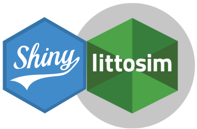
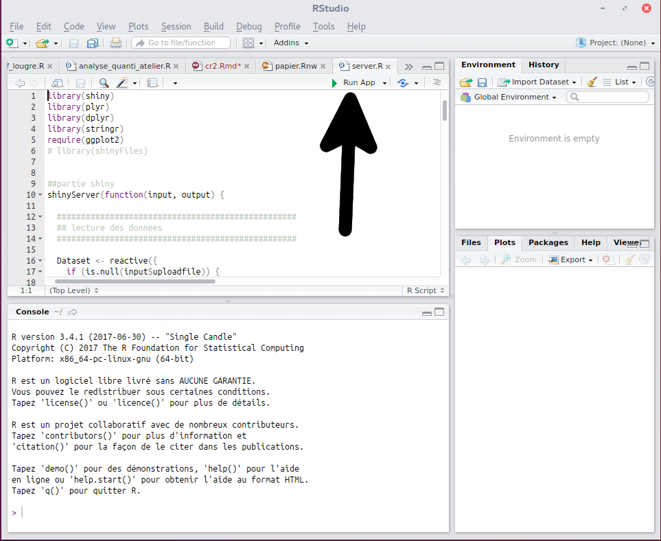
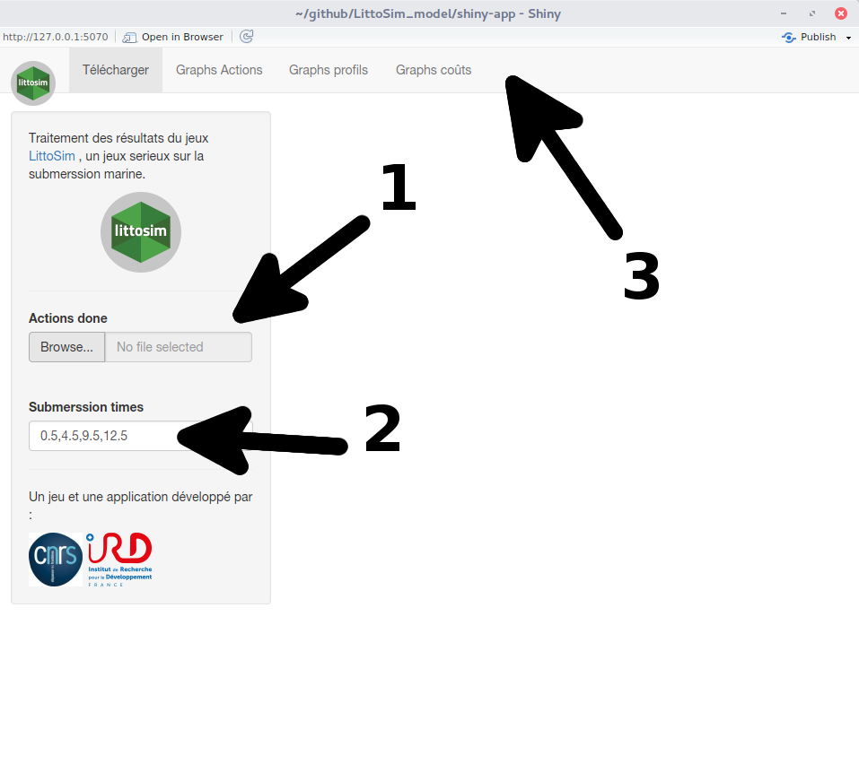

Shiny app : débrefing littoSim
=======================

# Contexte

[Shiny](https://shiny.rstudio.com/)1 est un package développé par [Rstudio](https://www.rstudio.com/) et qui permet de transformer un script de traitement R en une application web.

L'objectif de cette application est de permettre l'utilisation de traitement R à la partie débrefing des sessions de simulation participative. Le traitement doit être transparent pour les utilisateurs tout en permettant la production d'inducteurs (graphique et/ou numérique) facilitant la compréhension des dynamiques de la partie.

# Installation

1. Il faut installer [R](https://cran.r-project.org/)2 puis [Rstudio](https://www.rstudio.com/)3 .
2. Lancer Rstudio et depuis Tools \ Download Package, installer le package "[Shiny](https://shiny.rstudio.com/)"
3. Dans Rstudio copier coller la ligne suivante : `install.packages(c("ggplot2","stringr","dplyr","plyr"), dependencies = T)` et valider Entrer pour installer d'autres packages.
  * Si il y a eu des erreurs lors de l'install, alors faites un chargement de chacun des packages `plyr`, `dplyr`, `stringr`, `ggplot2` l'un après l'autre directement depuis le menu Tools/Install Packages
4. Recommencer plusieurs fois l'étape 3 si vous ne voyer pas les fenêtres de Download apparaitre

5- Télécharger depuis le GitHub LIttoSIM l'appli développée pour LittoSIM appelé Shiny-app (`git clone git@github.com:LittoSim/LittoSim_model.git`)

6- Dans RStudio ouvrez les fichiers `LittoSim_model/shiny-app/server.R` et `LittoSim_model/shiny-app/ui.R`

7- Puis, dans l'angle supérieur droit du script, cliquez sur Run APP

# Utilisation

Lancer l'application

Une fenêtre type "browser" et contenant l'interface s'ouvre :
1. charger l'ensemble des fichiers `action done` en maintenant la touche `ctrl` enfoncée
2. si les phases de submersion ont changé, vous pouvez les définir ici
3. Une fois les données chargées, vous aurez accès, dans les "onglets" aux différents graphes.

# Note
* L'application peut être ouverte dans le navigateur traditionnel en utilisant l'IP afficer en haut de l'interface. Généralement `http://127.0.0.1:5070`.
* Au besoin, les graphes générés peuvent être enregistrés par un clic droit sur les images.

1 le code source du package est sur github.

2 R est un logiciel (et un langage de programmation) distribuer sous licence libre ( Licence [GNU GPL3](https://www.r-project.org/Licenses/LGPL-3))

3 RSudio est un logiciel gratuit dans sa version communautaire.
